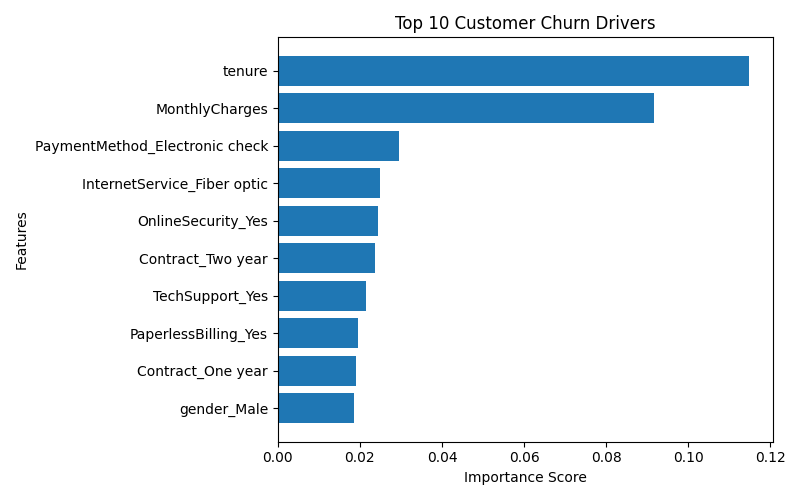

# Customer Churn Prediction using Machine Learning

## Project Overview

This project predicts customer churn using Machine Learning techniques. The objective is to identify customers who are likely to leave a telecom service provider and understand the factors influencing churn.

## Problem Statement

Customer churn is one of the most important business challenges in the telecom industry. Retaining existing customers is often more cost-effective than acquiring new ones. This project uses historical customer data to predict whether a customer is likely to churn.

## Tools & Technologies

* Python
* Pandas
* NumPy
* Scikit-learn
* Random Forest Classifier
* Google Colab
* GitHub

## Dataset

The dataset contains telecom customer information including:

* Customer Demographics
* Internet Service Details
* Contract Information
* Monthly Charges
* Customer Tenure
* Churn Status

## Data Preprocessing

* Converted target variable (Churn) into numerical format
* Removed unnecessary columns
* Applied One-Hot Encoding to categorical variables
* Split dataset into training and testing sets

## Machine Learning Model

Model Used:

* Random Forest Classifier

## Model Performance

Accuracy Achieved:

79.77%

Classification Report:

* Precision (No Churn): 0.82
* Recall (No Churn): 0.92
* Precision (Churn): 0.68
* Recall (Churn): 0.45
## Feature Importance

The chart highlights the most important factors influencing customer churn prediction.
## Confusion Matrix

[[957, 79],
[206, 167]]

## Key Insights

* Customer tenure is a strong indicator of churn.
* Monthly charges significantly influence customer retention.
* Contract type plays an important role in predicting churn.
* Long-term customers are less likely to churn.

## Business Impact

The model can help businesses:

* Identify high-risk customers
* Improve customer retention strategies
* Reduce revenue loss due to churn
* Design targeted marketing campaigns

## Repository Contents

* customer_churn_cleaned.csv
* analysis.ipynb
* feature_importance.png
* README.md

## Author

Sai Shashank R

MBA – Business Analytics
CMS Business School, Jain (Deemed-to-be University)
# customer-churn-prediction-ml
